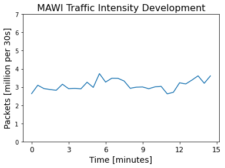
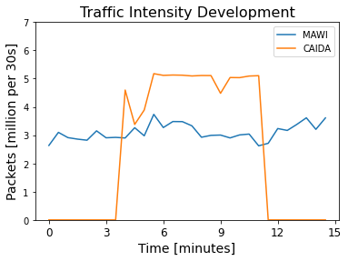
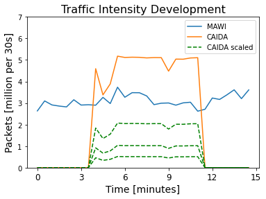
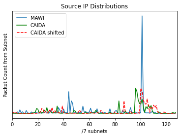
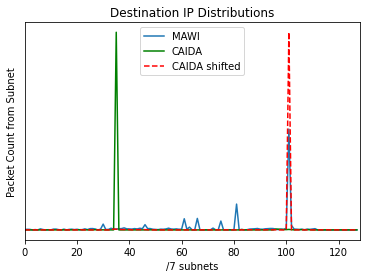
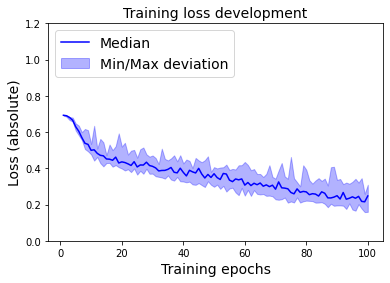
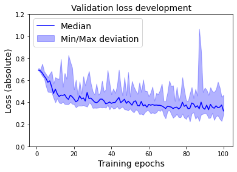
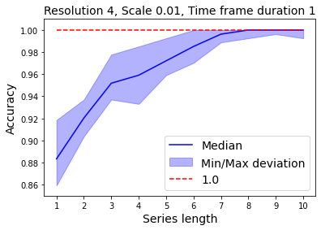
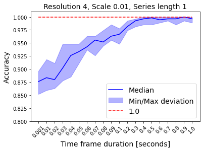

# HollwooDDoS: Detecting Volumetric Attacks in Moving Images of Network Traffic

This repository contains the code used for [HollywooDDoS](s.kit.edu/skopmann), including preprocessing, model training, evaluation and visualization.

## Repository structure
- data/ Holds all required data.
  - datasets/ Raw datasets ([CAIDA2007](https://www.caida.org/catalog/datasets/ddos-20070804_dataset/) and [MAWI2019](http://mawi.wide.ad.jp/mawi/samplepoint-F/2019/201909011400.html))
  - preprocessing/  Preprocessing ~ Image creation
  - training/  Training data is stored here after preprocessing.
- evaluation/  Results are analyzed, compared and visualized here.
- models/  Contains model architectures.
  - trained/  Stores trained models.
- results/  Holds training histories.
- training/  Holds training script and parameter file.

## Repository setup instructions
Download the datasets and store them in the `datasets/` directory. 
After the download is finished, navigate to the preprocessing directory `cd data/preprocessing` and
run the preprocessing scripts for each dataset `./mawi_preprocessing.sh` and `./caida_preprocessing.sh`.

After the raw traffic traces have been preprocessed, run the traffic composer `./traffic_composer.sh`.
The traffic composer injects CAIDA attack traffic into the MAWI background traffic.

Note that access to the DDoS traffic dataset needs to be provided by CAIDA. If you are not authorized to
access CAIDA data, you need to either request it for your research purposes or fall back to the preprocessed (aggregated) data provided by us via git large file storage.

Preprocessed datasets are in `csv` format. Each row of the `csv`-files represents a traffic image with its corresponding label (0,1) or (1,0).

## Datasets' visualization
### Traffic intensities for both background (MAWI) and attack (CAIDA) traffic:

 

### Traffic intensity comparison, as well as an illustration of scaled attack intensities:

 

### Source and destination IP address distributions, as well as attack subnet shift illustration:
Both source and destination address space are shifted for attack traffic. This shift is performed to achieve maximum
overlap between background and attack traffic to make attack detection as hard as possible with utilized 2D-representation.

 

### Training and Evaluation
Training can be started by adjusting `training/training_parameters.json` and executing `traing/traning.py`.
The notebook `visualization.ipynb` contains executable cells to illustrate training performance over all epochs, e.g., loss curves.

 

Visualization does not only contain metric development over epochs during the training, but also
comparative illustration across varying parameters, e.g., different image series lengths or different time frame durations.

 
